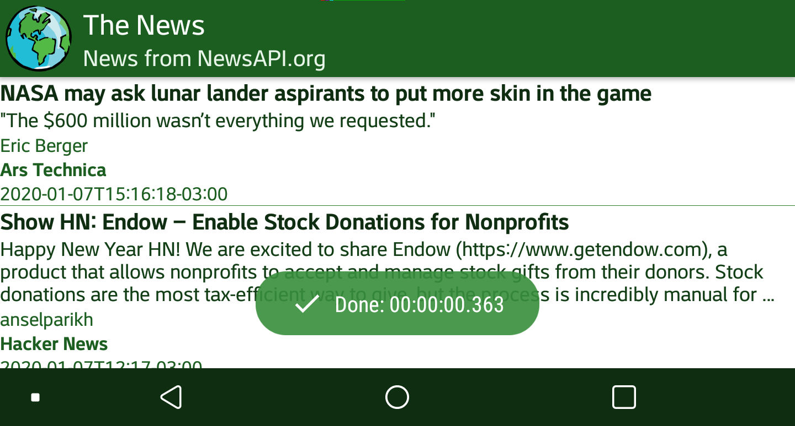
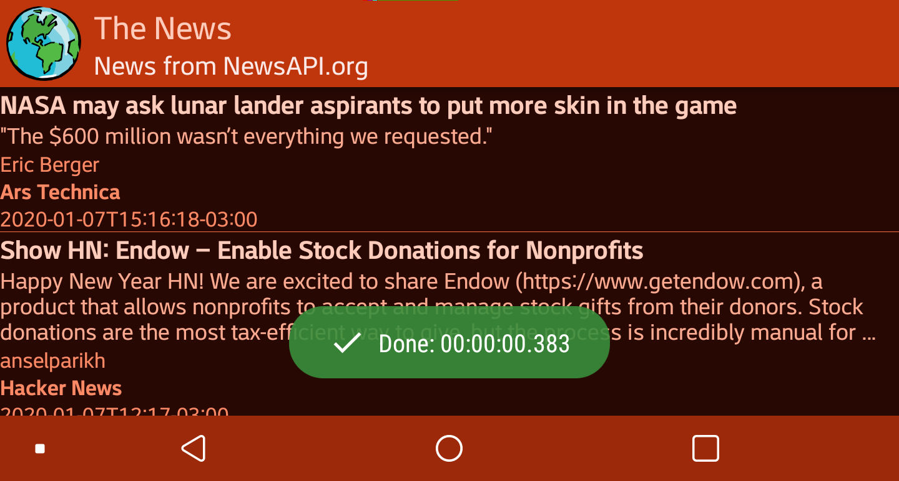

# Random News 
Android Studio - News - www.newsapi.org - Documentation Google Java Style

> An application to get news on any topic! 

## Index

* [Objetives](#objetives)
* [Description/Instructions](#descriptioninstrutions)
* [Screenshots](#screenshots)
* [Features](#features)
* [Technologies](#technologies)
* [Sources](#sources)
* [Status](#status)
* [License](#license)
* [Gratitude](#gratitude)
* [Contact](#contact)

## Objetives
This project developed in Android Studio must use an API as the source of
external information and then show all the data you can receive in the 
resulting application.
This application product of the project must implement many characteristics
generic that will be used later to build new applications
self-taught for different purposes.

## Description/Instrutions
You can see the news from the source of newsapi.org   in your application
RandomNews, this has an expandable image of reference to the selected article,
you can click on the news to read its full content.
In case you want to update the available news you have to swipe from the limit 
from the top screen down to the App to refresh your content and its articles 
are updated, which are ordered by time of publication.

## Screenshots

## Features
Night Mode 🌗

## Technologies
- JAVA 8 
- Gradle 
- multiple repositories to consume an API 

## Sources
- API news from [newsapi.org](https://newsapi.org/v2/)

## Status
- Project is Partially completed;
considering that the guides provided to build the App for the DSM class as 
first objective, because the application is open even to many improvements both 
functional and UI.

## License
Licenced by [Apache 2.0](https://www.apache.org/licenses/LICENSE-2.0.txt).

 
## Gratitude 
- to the guides and resources on the internet to fix the multiple problems that are
presented throughout the construction of this project.
- to the teacher for the guides as the main means to build the project.
- to colleagues from the DSM chair for helping to solve some problems
appeared along the way.
 
 
## Contact
- Created by [@CharlieCondorcet](https://github.com/charliecondotcet)
- To report bugs and feedback: RandomNewsSupport@charliedroid.com
- Official website to manage new Android projects: www.charliedroid.com
